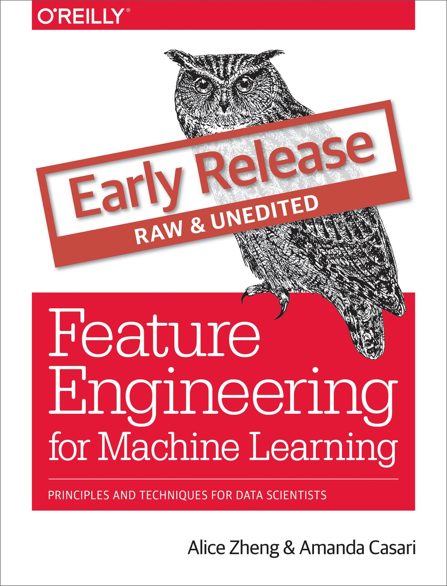

# 面向机器学习的特征工程

> **欢迎任何人参与和完善：一个人可以走的很快，但是一群人却可以走的更远**

* 原文（注册后可阅读）：[Feature Engineering for Machine Learning (Early Release)](https://www.safaribooksonline.com/library/view/feature-engineering-for/9781491953235/)
* **[ApacheCN - 学习机器学习群【629470233】](http://shang.qq.com/wpa/qunwpa?idkey=30e5f1123a79867570f665aa3a483ca404b1c3f77737bc01ec520ed5f078ddef)**
* **[Machine Learning in Action（机器学习实战）](https://github.com/apachecn/MachineLearning)| [ApacheCN（apache 中文网）](http://www.apachecn.org/)**
* **[@SeanCheney](https://www.jianshu.com/u/130f76596b02) 翻译的[《利用 Python 进行数据分析 第二版》](https://www.jianshu.com/p/04d180d90a3f)**

## 目录

+   [一、引言](1.引言.md)
+   [二、简单数字的奇特技巧](2.简单数据的奇特技巧.md)
+   [三、文本数据：展开、过滤和分块](3.文本数据.md)
+   [四、特征缩放的效果：从词袋到 TF-IDF](4.特征缩放的效果：从词袋到_TF-IDF.md)
+   [五、类别特征：机器鸡时代的鸡蛋计数](5.类别特征.md)
+   [六、降维：使用 PCA 压缩数据集](6.降维：用_PCA_压缩数据集.md)
+   [七、非线性特征提取和模型堆叠](7.非线性特征提取和模型堆叠.md)
+   [八、自动化特征提取器：图像特征提取和深度学习](8.自动化特征提取器：图像特征提取和深度学习.md)
+   九、回到特征：将它们放到一起
+   [附录、线性模型和线性代数基础](附录、线性模型和线性代数基础.md)

## 联系方式

### 负责人

* [@飞龙](https://github.com/wizardforcel): 562826179

### 贡献者

| 标题 | 译者 | 校对 |
| --- | --- | --- |
| 一、引言 | [@ZhipengYe](https://github.com/ZhipengYe) |
| 二、简单数字的奇特技巧 | [@coboe](https://github.com/coboe) |
| 三、文本数据：展开、过滤和分块 | [@kkejili](https://github.com/kkejili) | [@HeYun](https://github.com/KyrieHee) |
| 四、特征缩放的效果：从词袋到 TF-IDF | [@gin](https://github.com/tirtile) | [@HeYun](https://github.com/KyrieHee) |
| 五、类别特征：机器鸡时代的鸡蛋计数 | [@ZhenLei Xu](https://github.com/HadXu) |
| 六、降维：使用 PCA 压缩数据集 | [@cn-Wziv](https://github.com/cn-Wziv) | [@HeYun](https://github.com/KyrieHee) |
| 七、非线性特征提取和模型堆叠 | [@friedhelm739](https://github.com/friedhelm739) |
| 八、自动化特征提取器：图像特征提取和深度学习 | [@friedhelm739](https://github.com/friedhelm739) |
| 九、回到特征：将它们放到一起 | |
| 附录、线性模型和线性代数基础 | [@Sherlock-kid](https://github.com/Sherlock-kid) |

## 免责声明

ApacheCN 纯粹出于学习目的与个人兴趣翻译本书，不追求任何经济利益。

本译文只供学习研究参考之用，不得用于商业用途。ApacheCN 保留对此版本译文的署名权及其它相关权利。

## 赞助我们

## [ApacheCN 组织资源](http://www.apachecn.org/)

| 深度学习 | 机器学习  | 大数据 | 运维工具 |
| --- | --- | --- | --- |
| [TensorFlow R1.2 中文文档](http://cwiki.apachecn.org/pages/viewpage.action?pageId=10030122) | [机器学习实战-教学](https://github.com/apachecn/MachineLearning) | [Spark 2.2.0和2.0.2 中文文档](http://spark.apachecn.org/) | [Zeppelin 0.7.2 中文文档](http://cwiki.apachecn.org/pages/viewpage.action?pageId=10030467) |
| [Pytorch 0.3 中文文档](http://pytorch.apachecn.org) | [Sklearn 0.19 中文文档](http://sklearn.apachecn.org/) | [Storm 1.1.0和1.0.1 中文文档](http://storm.apachecn.org/) | [Kibana 5.2 中文文档](http://cwiki.apachecn.org/pages/viewpage.action?pageId=8159377) |
|  | [LightGBM 中文文档](http://lightgbm.apachecn.org/cn/latest) | [Kudu 1.4.0 中文文档](http://cwiki.apachecn.org/pages/viewpage.action?pageId=10813594) |  |
|  | [XGBoost 中文文档](http://xgboost.apachecn.org/cn/latest)  | [Elasticsearch 5.4 中文文档](http://cwiki.apachecn.org/pages/viewpage.action?pageId=4260364) |
|  | [kaggle: 机器学习竞赛](https://github.com/apachecn/kaggle) | [Beam 中文文档](http://beam.apachecn.org/) |
|  | [Sklearn 与 TensorFlow 机器学习实用指南](https://github.com/apachecn/hands_on_Ml_with_Sklearn_and_TF) |  |
