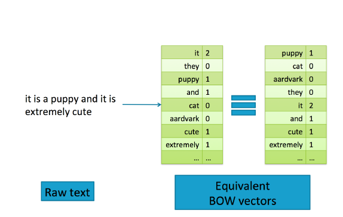
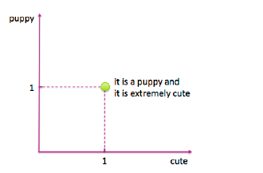
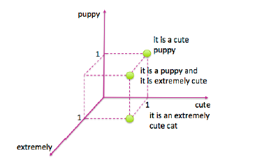
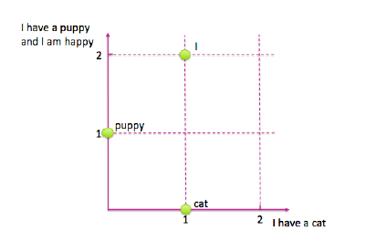
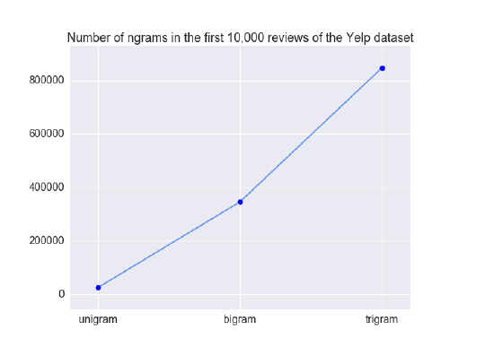
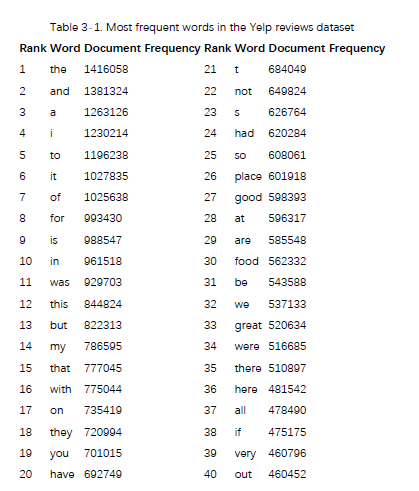
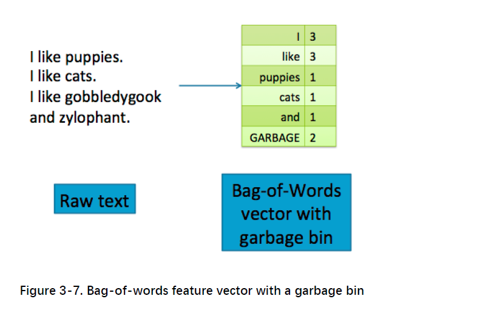
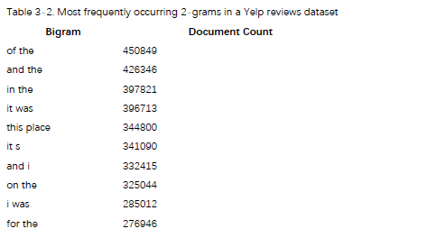

# 第三章：文本数据: 拉平、过滤和分块

如果你正在设计一个算法来分析以下段落，你会怎么做？

Emma knocked on the door. No answer. She knocked again and waited. There was a large maple tree next to the house. Emma looked up the tree and saw a giant raven perched at the treetop. Under the afternoon sun, the raven gleamed magnificently. Its beak was hard and pointed, its claws sharp and strong. It looked regal and imposing. It reigned the tree it stood on. The raven was looking straight at Emma with its beady black eyes. Emma felt slightly intimidated. She took a step back from the door and tentatively said, “hello?” 

该段包含很多信息。我们知道它谈到了到一个名叫Emma的人和一只乌鸦。这里有一座房子和一棵树，艾玛正想进屋，却看到了乌鸦。乌鸦很华丽，注意到艾玛，她有点害怕，但正在尝试交流。
那么，这些信息的哪些部分是我们应该提取的显着特征？首先，提取主要角色艾玛和乌鸦的名字似乎是个好主意。接下来，注意房子，门和树的设置可能也很好。关于乌鸦的描述呢？Emma的行为呢，敲门，退后一步，打招呼呢？
本章介绍文本特征工程的基础知识。我们从词袋（bags of words）开始，这是基于字数统计的最简单的文本功能。一个非常相关的变换是tf-idf，它本质上是一种特征缩放技术。它将被我在（下一篇）章节进行全面讨论。本章首先讨论文本提取功能，然后讨论如何过滤和清理这些功能。

## Bag of X:把自然文本变成平面向量

无论是构建机器学习模型还是特征工程，结果应该简单易懂。简单的事情很容易尝试，可解释的功能和模型比复杂的更易于调试。简单和可解释的功能并不总是会导致最精确的模型。但从简单开始就是一个好主意，只有在绝对必要时才会增加复杂性。
对于文本数据，我们可以从称为bag-of-words的字数统计开始。很多词并没有特别的意义，比如Emma或乌鸦。但是这两个词在该段落中被重复提到，并且它们在这里的计数比诸如“hello”之类的随机词更高。对于诸如分类文档之类的简单任务，字数统计通常足以用于该工作。它也可用于信息检索，其目标是检索与输入文本查询相关的一组文档。这两个任务都很好解释词级特征，因为某些特定词的存在可能是本文档主题内容的重要指标。

## 词袋

在词袋特征中，文本文档被转换成向量。 （向量只是n个数字的集合。）向量包含词汇表中每个单词可能出现的数目。 如果单词“aardvark”在文档中出现三次，则该特征向量在与该单词对应的位置上的计数为3。 如果词汇表中的单词没有出现在文档中，则它会得到零计数。 例如，“这是一只小狗，它是非常可爱”的句子具有如图所示的BOW表示


图片3-1转换词成向量描述图
Bag-of-Words将文本文档转换为平面向量。 它是“平面的”，因为它不包含任何原始的文本结构。 原文是一系列词语。 但是词袋向量的话没有序列; 它只是记得每个单词在文本中出现多少次。 它不代表任何词层次结构的概念。 例如，“动物”的概念包括“狗”，“猫”，“乌鸦”等。但是在一个词袋表示中，这些词都是矢量的相同元素。



图3-2两个等效的词向量，向量中单词的排序不重要，只要它在数据集中的个数和文档中出现数量是一致的。
重要的是特征空间中数据的几何形状。 在一个词袋矢量中，每个单词成为矢量的一个维度。 如果词汇表中有n个单词，则文档将成为n维空间中的一个点。 很难想象二维或三维以外的任何物体的几何形状，所以我们必须使用我们的想象力。 图3-3显示了我们的例句在对应于“小狗”和“可爱”两个维度的特征空间中的样子。



图3-3特征空间中文本文档的事例



图3-4三维特征空间
图3-3和图3-4描绘了特征空间中的数据向量。 坐标轴表示单个单词，它们是词袋表示下的特征，空间中的点表示数据点（文本文档）。 有时在数据空间中查看特征向量也是有益的。 特征向量包含每个数据点中特征的值。 轴表示单个数据点和点
表示特征向量。 图3-5显示了一个例子。 通过对文本文档进行词袋特征化，一个特征是一个词，一个特征向量包含每个文档中这个词的计数。 这样，一个单词被表示为一个“一个词向量”。正如我们将在第4章中看到的那样，这些文档词向量来自单词向量的矩阵转置。



## Bag-of-N-Grams 

是Bag-of-Words的自然延伸。 n-gram是n个有序的tokens。一个词基本上是一个1-gram，也被称为一个单元。标记后，计数机制可以将单个词进行计数，或将重叠序列计数为n-gram。例如，“Emma knocked on the door”这句话会产生n-gram，如“Emma knocked”，“knocked on”，“on the”，”the door”。
N-gram保留了文本的更多原始序列结构，因此bag-of-ngrams可以提供更多信息。但是，这是有代价的。理论上，用k个独特的词，可能有k个独立的2-grams（也称为bigrams）。在实践中，并不是那么多，因为不是每个单词都可以跟随每一个单词。尽管如此，通常有更多不同的n-gram（n> 1）比单词更多。这意味着，词袋会更大，更稀疏的特征空间。这也意味着n-grams计算，存储和建模的成本更高。 n越大，信息越丰富，成本越高。
为了说明随着n增加n-gram的数量如何增加，我们来计算纽约时报文章数据集上的n-gram。我们使用Pandas和scikit-learn中的CountVectorizer转换器来计算前10,000条评论的n-gram。

```python
>>> import pandas 
>>> import json 
>>> from sklearn.feature_extraction.text import CountVectorizer 
# Load the first 10,000 reviews 
>>> f = open('data/yelp/v6/yelp_dataset_challenge_academic_dataset/yelp_academic_dataset_review.json') 
>>> js = [] 
>>> for i in range(10000): 
... js.append(json.loads(f.readline())) 
>>> f.close() 
>>> review_df = pd.DataFrame(js) 
# Create feature transformers for unigram, bigram, and trigram. 
# The default ignores single-character words, which is useful in practice because it trims 
# uninformative words. But we explicitly include them in this example for illustration purposes. 
>>> bow_converter = CountVectorizer(token_pattern='(?u)\\b\\w+\\b') 
>>> bigram_converter = CountVectorizer(ngram_range=(2,2), token_pattern='(?u)\\b\\w+\\b') 
>>> trigram_converter = CountVectorizer(ngram_range=(3,3), token_pattern='(?u)\\b\\w+\\b') 
# Fit the transformers and look at vocabulary size 
>>> bow_converter.fit(review_df['text']) 
>>> words = bow_converter.get_feature_names() 
>>> bigram_converter.fit(review_df['text']) 
>>> bigrams = bigram_converter.get_feature_names() 
>>> trigram_converter.fit(review_df['text']) 
>>> trigrams = trigram_converter.get_feature_names() 
>>> print (len(words), len(bigrams), len(trigrams)) 
26047 346301 847545 
# Sneak a peek at the ngrams themselves
>>> words[:10] 
['0', '00', '000', '0002', '00am', '00ish', '00pm', '01', '01am', '02'] 
>>> bigrams[-10:] 
['zucchinis at', 
'zucchinis took', 
'zucchinis we', 
'zuma over', 
'zuppa di', 
'zuppa toscana', 
'zuppe di', 
'zurich and', 
'zz top', 
'à la'] 
>>> trigrams[:10] 
['0 10 definitely', 
'0 2 also', 
'0 25 per', 
'0 3 miles', 
'0 30 a', 
'0 30 everything', 
'0 30 lb', 
'0 35 tip', 
'0 5 curry', 
'0 5 pork'] 
```



图3-6Number of unique n-grams in the first 10,000reviews of the Yelp dataset

### 过滤和清洗特征

我们如何清晰地将信号从噪声中分离出来？ 通过过滤，使用原始标记化和计数来生成简单词表或n-gram列表的技术变得更加可用。 短语检测，我们将在下面讨论，可以看作是一个特别的bigram filter。 以下是执行过滤的几种方法。

### 停用词

分类和检索通常不需要对文本有深入的理解。 例如，在“Emma knocked on the door”一句中，“on”和“the”这两个词不包含很多信息。 代词，和介词大部分都没有增加太多价值。 流行的Python NLP软件包NLTK包含许多语言的语言学家定义的停用词列表。 （您将需要安装NLTK并运行'nltk.download（）'来获取所有的好东西。）各种停用词列表也可以
在网上找到。 例如，这里有一些来自英语停用词的示例词
a, about, above, am, an, been, didn’t, couldn’t, i’d, i’ll, itself, let’s, myself, our, they, through, when’s, whom, ... 
请注意，该列表包含撇号，并且这些单词没有大写。 为了按原样使用它，标记化过程不得去掉撇号，并且这些词需要转换为小写。

### Frequency-based filtering

停用词列表是一种清除常见词的方法，它们可以为空白功能创造条件。 还有其他更多的统计方法来获得“常用词”的概念。在搭配提取中，我们看到依赖于手动定义的方法以及使用统计的方法。 同样的想法可以用于字词过滤。 我们也可以在这里使用频率统计。

### Frequent words

频率统计对滤除语料库专用常用词以及通用停用词很有用。例如，纽约时报文章数据集中经常出现“纽约时报”和每个单词。 “议院”这个词经常出现在加拿大议会辩论的Hansard语料库中的“众议院”一词中，这是一种用于统计机器翻译的流行数据集，因为它包含所有文档的英文和法文版本。这些词在普通语言中有意义，但不在语料库中。手动定义的停用词列表将捕获一般停用词，但不是语料库特定的停用词。
表3-1列出了Yelp评论数据集中最常用的40个单词。在这里，频率被认为是它们出现在文件（评论）中的数量，而不是它们在文件中的数量。正如我们所看到的，该列表涵盖了许多停用词。它也包含一些惊喜。 “s”和“t”在列表中，因为我们使用撇号作为标记化分隔符，并且诸如“Mary's”或“did not”之类的词被解析为“Mary s”和“didn t”。词“good”“，”food“和”great“分别出现在三分之一的评论中。但我们可能希望保留它们，因为它们对于情感分析或业务分类非常有用



最常用的单词最可以揭示问题，并突出显示通常在该语料库中出现过多次的通常有用的单词。 例如，纽约时报语料库中最常见的词是“时代”。实际上，它有助于将基于频率的过滤与停用词列表结合起来。还有一个棘手的问题，即何处放置截止点。 没有普遍的答案，大多数情况下，需要手动确定截止点，并且可能需要在数据集更改时重新检查。
根据任务的不同，可能还需要筛选出难得的单词。对于统计模型而言，仅出现在一个或两个文档中的单词更像噪声而非有用信息。例如，假设任务是根据他们的Yelp评论对企业进行分类，并且单个评论包含“gobbledygook”这个词。基于这一个词，我们将如何说明这家企业是餐厅，美容院还是一间酒吧？即使我们知道在这种情况下的这种生意发生在酒吧，它也会对于其他包含“gobbledygook”这个词的评论来说，这可能是一个错误。
不仅罕见的单词不可靠，而且还会产生计算开销。这套160万个Yelp评论包含357,481个独特单词（用空格和标点符号表示），其中189,915只出现在一次评论中，41,162次出现在两次评论中。超过60％的词汇很少发生。这是一种所谓的重尾分布，在现实世界的数据中非常普遍。许多统计机器学习模型的训练时间随着特征数量线性地变化，并且一些模型是二次的或更差的。罕见的词汇会产生大量的计算和存储成本，而不会带来额外的收益。
根据字数统计，可以很容易地识别和修剪稀有字词。或者，他们的计数可以汇总到一个特殊的垃圾箱中，可以作为附加功能。图3-7展示了一个短文档中的表示形式，该短文档包含一些常用单词和两个罕见单词“gobbledygook”和“zylophant”。通常单词保留自己的计数，可以通过停用词列表或其他频率进一步过滤方法。这些难得的单词会失去他们的身份并被分组到垃圾桶功能中



由于在计算整个语料库之前不会知道哪些词很少，因此需要收集垃圾桶功能作为后处理步骤。
由于本书是关于特征工程的，因此我们将重点放在特征上。 但稀有概念也适用于数据点。 如果文本文档很短，那么它可能不包含有用的信息，并且在训练模型时不应使用该信息。
应用此规则时必须谨慎。 维基百科转储包含许多不完整的存根，可能安全过滤。 另一方面，推文本身就很短，并且需要其他特征和建模技巧。
简单解析的一个问题是同一个单词的不同变体会被计算为单独的单词。例如，“flower”和“flowers”在技术上是不同的标记，“swimmer”，“swimming,”和“swim,”也是如此，尽管它们的含义非常接近。如果所有这些不同的变体都映射到同一个单词，那将会很好。
Stemming是一项NLP任务，试图将单词切分为基本的语言词干形式。有不同的方法。有些基于语言规则，其他基于观察统计。被称为词形化的算法的一个子类将词性标注和语言规则结合起来。
Porter stemmer是英语中使用最广泛的免费词干工具。原来的程序是用ANSI C编写的，但是很多其他程序包已经封装它来提供对其他语言的访问。尽管其他语言的努力正在进行，但大多数词干工具专注于英语。
以下是通过NLTK Python包运行Porter stemmer的示例。正如我们所看到的，它处理了大量的情况，包括将“sixties”和“sixty”转变为同一根“sixti”。但这并不完美。单词“goes”映射到“goe”，而“go”映射到它自己。

```python
>>> import nltk 
>>> stemmer = nltk.stem.porter.PorterStemmer() 
>>> stemmer.stem('flowers') 
u'lemon' 
>>> stemmer.stem('zeroes') 
u'zero' 
>>> stemmer.stem('stemmer') 
u'stem' 
>>> stemmer.stem('sixties') 
u'sixti' 
>>> stemmer.stem('sixty') 
u'sixty' 
>>> stemmer.stem('goes') 
u'goe' 
>>> stemmer.stem('go') 
u'go' 
```

stemming的确有一个计算成本。 最终收益是否大于成本取决于应用程序。
Atoms of Meaning:From words to N-Grams to Phrases
词袋的概念很简单。 但是，一台电脑怎么知道一个词是什么？ 文本文档以数字形式表示为一个字符串，基本上是一系列字符。 也可能会遇到JSON blob或HTML页面形式的半结构化文本。 但即使添加了标签和结构，基本单位仍然是一个字符串。 如何将字符串转换为一系列的单词？ 这涉及解析和标记化的任务，我们将在下面讨论。
Parsing and tokenization
当字符串包含的不仅仅是纯文本时，解析是必要的。例如，如果原始数据是网页，电子邮件或某种类型的日志，则它包含额外的结构。人们需要决定如何处理日志中的标记，页眉，页脚或无趣的部分。如果文档是网页，则解析器需要处理URL。如果是电子邮件，则可能需要特殊字段，例如From，To和Subject需要被特别处理，否则，这些标题将作为最终计数中的普通单词统计，这可能没有用处。
解析后，文档的纯文本部分可以通过标记。这将字符串（一系列字符）转换为一系列tokenization。然后可以将每个token计为一个单词。The tokenzier需要知道哪些字符表示一个token已经结束，另一个正在开始。空格字符通常是好的分隔符，正如标点符号一样。如果文本包含推文，则不应将哈希标记（＃）用作分隔符（也称为分隔符）。
有时，分析需要使用句子而不是整个文档。例如，n-gram是一个句子的概括，不应超出句子范围。更复杂的文本特征化方法，如word2vec也适用于句子或段落。在这些情况下，需要首先将文档解析为句子，然后将每个句子进一步标记为单词。

字符串对象有各种编码，如ASCII或Unicode。 纯英文文本可以用ASCII编码。 一般语言需要Unicode。 如果文档包含非ASCII字符，则确保分词器可以处理该特定编码。 否则，结果将不正确。
Collocation Extraction for Phrase Detection
连续的token能立即被转化成词表和n-grams。但从语义上讲，我们更习惯于理解短语，而不是n-gram。在计算自然语言处理中，有用短语的概念被称为搭配。用Manning和Schütze（1999：141）的话来说：“配对是一个由两个或两个以上单词组成的表达，它们对应于某种常规的说话方式。”
搭配比其部分的总和更有意义。例如，“strong tea ”具有超越“great physical strength”和“tea”的不同含义，因此被认为是搭配。另一方面，“可爱的小狗”这个短语恰恰意味着它的部分总和：“可爱”和“小狗”。因此，它不被视为搭配。
搭配不一定是连续的序列。“Emma knocked on the door” 一词被认为包含搭配“knock door.”，因此不是每一个搭配都是一个n-gram。相反，并不是每个n-gram都被认为是一个有意义的搭配。
由于搭配不仅仅是其部分的总和，它们的含义也不能通过单个单词计数来充分表达。作为一种表现形式，词袋不足。袋子的ngram也是有问题的，因为它们捕获了太多无意义的序列（考虑“this is” in the bag-of-ngrams example ），而没有足够的有意义的序列。
搭配作为功能很有用。但是，如何从文本中发现并提取它们呢？一种方法是预先定义它们。如果我们努力尝试，我们可能会找到各种语言的全面成语列表，我们可以通过文本查看任何匹配。这将是非常昂贵的，但它会工作。如果语料库是非常特定领域的并且包含深奥的术语，那么这可能是首选的方法。但是这个列表需要大量的手动管理，并且需要不断更新语料库。例如，分析推文，博客和文章可能不太现实。
自从过去二十年统计NLP的出现以来，人们越来越多地选择用于查找短语的统计方法。统计搭配提取方法不是建立固定的短语和惯用语言列表，而是依赖不断发展的数据来揭示当今流行的语言。
Frequency-based methods
一个简单的黑客就是看最频繁发生的n-gram。 这种方法的问题是最常发生的可能不是最有用的。 表3-2显示了整个Yelp评论数据集中最流行的bigrams（n=2）。 正如我们所知的，按文件计数排列的最常见的十大常见术语是非常通用的术语，并不包含太多含义。



Hypothesis testing for collocation extraction
Raw popularity count是一个太粗糙方法。我们必须找到更聪明的统计数据才能够轻松挑选出有意义的短语。关键的想法是看两个单词是否经常出现在一起。回答这个问题的统计机制被称为假设检验。
假设检验是将噪音数据归结为“是”或“否”的答案。它涉及将数据建模为从随机分布中抽取的样本。随机性意味着人们永远无法100％确定答案;总会有异常的机会。所以答案附在概率上。例如，假设检验的结果可能是“这两个数据集来自同一分布，其概率为95％”。对于假设检验的温和介绍，请参阅可汗学院关于假设检验和p值的教程。
在搭配提取的背景下，多年来已经提出了许多假设检验。最成功的方法之一是基于似然比检验（Dunning，1993）。对于给定的一对单词，该方法测试两个假设
观察的数据集。假设1（无效假设）表示，词语1独立于词语2出现。另一种说法是说，看到词语1对我们是否看到词语2没有影响。假设2（备选假设）说，看到词1改变了看到单词2的可能性。我们采用备选假设来暗示这两个单词形成一个共同的短语。因此，短语检测（也称为搭配提取）的似然比检验提出了以下问题：给定文本语料库中观察到的单词出现更可能是从两个单词彼此独立出现的模型中生成的，或者模型中两个词的概率纠缠？
这是有用的。让我们算一点。 （数学非常精确和简洁地表达事物，但它确实需要与自然语言完全不同的分析器。）


似然函数L（Data; H）表示在单词对的独立模型或非独立模型下观察数据集中词频的概率。 为了计算这个概率，我们必须对如何生成数据做出另一个假设。 最简单的数据生成模型是二项模型，其中对于数据集中的每个单词，我们抛出一个硬币，并且如果硬币朝上出现，我们插入我们的特殊单词，否则插入其他单词。 在此策略下，特殊词的出现次数遵循二项分布。 二项分布完全由词的总数，词的出现次数和词首概率决定。
似然比检验分析常用短语的算法 
收益如下。 
1.计算所有单体词的出现概率：p（w）。 
2.计算所有唯一双元的条件成对词发生概率：p（W 2×W 1） 
3.计算所有唯一的双对数似然比对数。 
4.根据它们的似然比排序双字节。 
5.以最小似然比值作为特征。 
Getting a Grip on Likelihood Ratio Test
关键在于测试比较的不是概率参数本身，而是在这些参数（以及假设的数据生成模型）下观察观察数据的概率。可能性是统计学习的关键原则之一。但是在你看到它的前几次，这绝对是一个令人困惑的问题。一旦你确定了逻辑，它就变得直观了。
还有另一种基于点互信息的统计方法。但它对真实世界文本语料库中常见的罕见词很敏感。因此它不常用，我们不会在这里展示它。
请注意，搭配抽取的所有统计方法，无论是使用原始频率，假设测试还是点对点互信息，都是通过过滤候选词组列表来进行操作的。生成这种清单的最简单和最便宜的方法是计算n-gram。有可能产生不连续的序列，但是它们计算起来很昂贵。在实践中，即使是连续n-gram，人们也很少超过bi-grams或tri-grams，因为即使在过滤之后，它们的数量也很多。为了生成更长的短语，还有其他方法，如chunking或与词性标注相结合。


Chunking and part-of-Speech Tagging
Chunking比n-gram要复杂一点，因为它基于词性，基于规则的模型形成了tokens序列。
例如，我们可能最感兴趣的是在问题中找到所有名词短语，其中文本的实体，主题最为有趣。 为了找到这个，我们使用词性标记每个作品，然后检查该标记的邻域以查找词性分组或“块”。 定义单词到词类的模型通常是语言特定的。 几种开源Python库（如NLTK，Spacy和TextBlob）具有多种语言模型。
为了说明Python中的几个库如何使用词性标注非常简单地进行分块，我们再次使用Yelp评论数据集。 我们将使用spacy和TextBlob来评估词类以找到名词短语。

```python
>>> import pandas as pd 
>>> import json 
# Load the first 10 reviews 
>>> f = open('data/yelp/v6/yelp_dataset_challenge_academic_dataset/yelp_academic_dataset_review.json') 
>>> js = [] 
>>> for i in range(10): 
js.append(json.loads(f.readline())) 
>>> f.close() 
>>> review_df = pd.DataFrame(js) 
## First we'll walk through spaCy's functions 
>>> import spacy 
# preload the language model 
>>> nlp = spacy.load('en') 
# We can create a Pandas Series of spaCy nlp variables 
>>> doc_df = review_df['text'].apply(nlp) 
# spaCy gives you fine grained parts of speech using: (.pos_) 
# and coarse grained parts of speech using: (.tag_) 
>>> for doc in doc_df[4]: 
print([doc.text, doc.pos_, doc.tag_]) 
Got VERB VBP 
a DET DT 
letter NOUN NN 
in ADP IN 
the DET DT 
mail NOUN NN 
last ADJ JJ 
week NOUN NN 
that ADJ WDT 
said VERB VBD 
Dr. PROPN NNP 
Goldberg PROPN NNP 
is VERB VBZ 
moving VERB VBG 
to ADP IN 
Arizona PROPN NNP 
to PART TO 
take VERB VB 
a DET DT 
new ADJ JJ 
position NOUN NN 
there ADV RB 
in ADP IN 
June PROPN NNP 
. PUNCT . 
SPACE SP 
He PRON PRP 
will VERB MD 
be VERB VB 
missed VERB VBN 
very ADV RB 
much ADV RB 
. PUNCT . 
SPACE SP 
I PRON PRP 
think VERB VBP 
finding VERB VBG 
a DET DT 
new ADJ JJ 
doctor NOUN NN 
in ADP IN 
NYC PROPN NNP 
that ADP IN 
you PRON PRP 
actually ADV RB 
like INTJ UH 
might VERB MD 
almost ADV RB 
be VERB VB 
as ADV RB 
awful ADJ JJ 
as ADP IN 
trying VERB VBG 
to PART TO 
find VERB VB 
a DET DT 
date NOUN NN 
! PUNCT . 
# spaCy also does some basic noun chunking for us 
>>> print([chunk for chunk in doc_df[4].noun_chunks]) 
[a letter, the mail, Dr. Goldberg, Arizona, a new position, June, He, I, a new doctor, NYC, you, a date] 
##### 
## We can do the same feature transformations using Textblob 
>>> from textblob import TextBlob 
# The default tagger in TextBlob uses the PatternTagger, which is fine for our example. 
# You can also specify the NLTK tagger, which works better for incomplete sentences. 
>>> blob_df = review_df['text'].apply(TextBlob) 
>>> blob_df[4].tags 
[('Got', 'NNP'), 
('a', 'DT'), 
('letter', 'NN'), 
('in', 'IN'), 
('the', 'DT'), 
('mail', 'NN'), 
('last', 'JJ'), 
('week', 'NN'), 
('that', 'WDT'), 
('said', 'VBD'), 
('Dr.', 'NNP'), 
('Goldberg', 'NNP'), 
('is', 'VBZ'), 
('moving', 'VBG'), 
('to', 'TO'), 
('Arizona', 'NNP'), 
('to', 'TO'), 
('take', 'VB'), 
('a', 'DT'), 
('new', 'JJ'), 
('position', 'NN'), 
('there', 'RB'), 
('in', 'IN'), 
('June', 'NNP'), 
('He', 'PRP'), 
('will', 'MD'), 
('be', 'VB'), 
('missed', 'VBN'), 
('very', 'RB'), 
('much', 'JJ'), 
('I', 'PRP'), 
('think', 'VBP'), 
('finding', 'VBG'), 
('a', 'DT'), 
('new', 'JJ'), 
('doctor', 'NN'), 
('in', 'IN'), 
('NYC', 'NNP'), 
('that', 'IN'), 
('you', 'PRP'), 
('actually', 'RB'), 
('like', 'IN'), 
('might', 'MD'), 
('almost', 'RB'), 
('be', 'VB'), 
('as', 'RB'), 
('awful', 'JJ'), 
('as', 'IN'), 
('trying', 'VBG'), 
('to', 'TO'), 
('find', 'VB'), 
('a', 'DT'), 
('date', 'NN')] 
>>> print([np for np in blob_df[4].noun_phrases]) 
['got', 'goldberg', 'arizona', 'new position', 'june', 'new doctor', 'nyc' 
```

你可以看到每个库找到的名词短语有些不同。 spacy包含英语中的常见单词，如“a”和“the”，而TextBlob则删除这些单词，这反映了规则引擎中驱动每个图书馆认为是“名词短语”的不同之处。 以确定您正在寻找的块。使用Python进行自然语言处理可以深入了解从头开始用Python进行分块。

## 总结：

词袋易于理解，易于计算，对分类和搜索任务很有用。但有时单个单词太简单，不足以将文本中的某些信息封装起来。为了解决这个问题，人们期望更长的序列。Bag-of-ngrams这个概念仍然很容易理解，而且它的计算比较大。
Bag of-ngrams生成更多不同的ngram。它增加了特征存储成本，以及模型训练和预测阶段的计算成本。数据点的数量保持不变，但特征空间的维度现在更大。因此数据密度更为稀疏。 n越高，存储和计算成本越高，数据越稀疏。由于这些原因，
较长的n-gram并不总是会导致模型精度的提高（或任何其他性能指标）。人们通常在n = 2或3时停止。较少的n-gram很少被使用。
防止稀疏性和成本增加的一种方法是过滤n-gram并保留最有意义的短语。这是搭配抽取的目标。理论上，搭配（或短语）可以在文本中形成非连续的标记序列。然而，在实践中，寻找非连续词组的计算成本要高得多，而没有太多的收益。因此搭配抽取通常从一个候选人名单中开始，并利用统计方法对他们进行过滤。
所有这些方法都将一系列文本标记转换为一组断开的计数。与一个序列相比，一个集合的结构要少得多;他们导致平面特征向量。
在本章中，我们用简单的语言描述文本特征化技术。这些技术将一段充满丰富语义结构的自然语言文本转化为一个简单的平面向量。我们讨论一些常用的过滤技术来降低向量维度。我们还引入了ngrams和搭配抽取作为方法，在平面向量中添加更多的结构。下一章将详细介绍另一种常见的文本特征化技巧，称为tf-idf。随后的章节将讨论更多方法将结构添加回平面向量。

## 参考文献：

Dunning, Ted. 1993. “Accurate methods for the statistics of surprise and
coincidence.” ACM Journal of Computational Linguistics, special issue on using large corpora , 19:1 (61—74).
“Hypothesis Testing and p-Values.” Khan Academy, accessed May 31,
2016,https://www.khanacademy.org/math/probability/statistics-inferential/hypothesis-testing/v/hypothesis-testing-and-p-values.
Manning,Christopher D. and Hinrich Schütze. 1999. Foundations of StatisticalNatural Language Processing . Cambridge, Massachusettes: MIT Press.
Sometimes people call it the document “vector.” The vector extends from the original and ends at the specified point. For our purposes, “vector” and “point” are the same thing.


