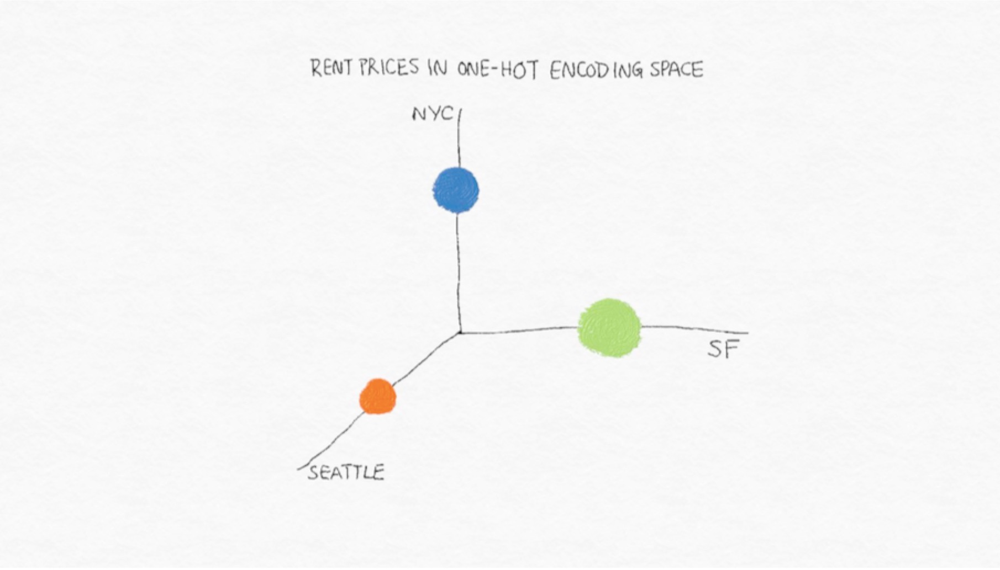
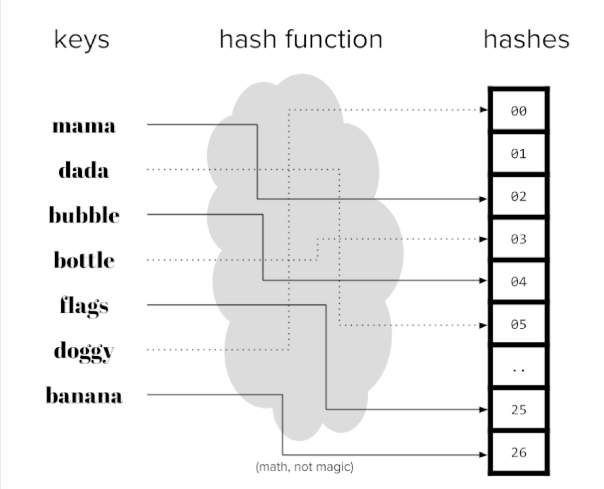

# 第5张 类别特征:机器鸡时代的鸡蛋计数

一个类别特征，见名思义，就是用来表达一种类别或标签。比如，一个类别特征能够表达世界上的主要城市，一年四季，或者说一个公司的产品(石油、路程、技术)。在真实世界的数据集中，类别值的数量总是无限的。同时这些值一般可以用数值来表示。但是，与其他数值变量不一样的是，类别特征的数值变量无法与其他数值变量进行比较大小。(作为行业类型，石油与旅行无法进行比较)它们被称之为非序的。

一个简单的问题可以作为测试是否应该是一个分类变量的试金石测试：“两个价值有多么不同，或者只是它们不同？”500美元的股票价格比100美元的价格高5倍。 所以股票价格应该用一个连续的数字变量表示。 另一方面，公司的产业（石油，旅游，技术等）应该无法被比较的，也就是类别特征。

大的分类变量在交易记录中特别常见。 对于实例中，许多Web服务使用id作为分类变量来跟踪用户具有数百至数百万的值，取决于唯一的数量服务的用户。 互联网交易的IP地址是另一个例子一个很大的分类变量。 它们是分类变量，因为即使用户ID和IP地址是数字，它们的大小通常与任务无关在眼前。 例如，在进行欺诈检测时，IP地址可能是相关的个人交易。 某些IP地址或子网可能会产生更多欺骗性交易比其他人。 但是164.203.x.x的子网本质上并不多欺诈性比164.202.x.x; 子网的数值无关紧要。

文档语料库的词汇可以被解释为一个大的分类变量，类别是唯一的单词。 它可能在计算上很昂贵代表如此多的不同类别。 如果一个类别（例如，单词）出现多个数据点（文档）中的时间，然后我们可以将它表示为一个计数并表示所有的类别通过他们的统计数字。 这被称为bin-counting。 我们用分类变量的共同表示开始讨论，并且最终蜿蜒曲折地讨论了大范围的bin-counting问题变量，这在现代数据集中非常普遍。

## 对类别特征进行编码

分类变量的类别通常不是数字。例如，眼睛的颜色可以是“黑色”，“蓝色”，“棕色”等。因此，需要使用编码方法将这些非数字类别变为数字。 简单地将一个整数（比如1到k）分配给k个可能的类别中的每一个都是诱人的。 但是，由此产生的价值观可以互相授权，这在类别中不应该被允许。

## One-hot 编码

将类别特征进行表示一个最好的办法就是使用一组比特位来表达。每一位代表一个可能的类别。 如果该变量不能一次成为多个类别，那么该组中只有一位可以是1。 这被称为单热编码，它在Scikit Learn中实现[sklearn.preprocessing.OneHotEncoder](http://scikit-learn.org/stable/modules/generated/sklearn.preprocessing.OneHotEncoder.html)。 每个位都是一个特征。 因此是一个绝对的具有k个可能类别的变量被编码为长度为k的特征向量。

表5-1 对3个城市的类别进行独热编码

|City|e1|e2|e3|
|:-:|:-:|:-:|:-:|
|San Francisco|1|0|0|
|New York|0|1|0|
|Seattle|0|0|1|

单热编码非常易于理解。 但它使用的是比严格必要的更多的一点。 如果我们看到k-1位是零，那么最后一位必须是1，因为变量必须具有k个值中的一个。 在数学上，可以写下这个约束条件为“所有位的和必须等于1”。

等式 5-1. 独热编码```e1,e2,e3```限制条件。

```e1+e2+e3+...+ek=1```

因此，我们有一个线性的依赖性。 线性相关特征，就像我们一样在```tfidf```中发现，有点烦人，因为它意味着训练线性模型不会是唯一的。 特征的不同线性组合可以做出同样的预测，所以我们需要跳过额外条件的来理解特征对预测的影响。

## dummy编码

单热编码的问题是它允许k个自由度，其中变量本身只需要k-1。 虚拟编码通过仅使用表示中的k-1个特征来消除额外的自由度。 公共汽车下面有一个特征，由全零矢量表示。 这被称为参考类别。 虚拟编码和单热编码都是在Pandas中以[pandas.get_dummies](http://pandas.pydata.org/pandas-docs/stable/generated/pandas.get_dummies.html)的形式实现的。

表5-2 对3个城市的类别进行dummy编码

|City|e1|e2|
|:-:|:-:|:-:|
|San Francisco|1|0|
|New York|0|1|
|Seattle|0|0|

使用虚拟编码进行建模的结果比单编码更易解释。这很容易在简单的线性回归问题中看到。 假设我们有一些数据关于三个城市的公寓租赁价格：旧金山，纽约和西雅图。（见表5-3）

表5-3 三个不同城市的公寓价格数据集

|id|city|Rent|
|:-:|:-:|:-:|
|0|SF|3999|
|1|SF|4000|
|2|SF|4001|
|3|NYC|3499|
|4|NYC|3500|
|5|NYC|3501|
|6|Seattle|2499|
|7|Seattle|2500|
|8|Seattle|2501|



图5-1 公寓租金价格在one-hot编码中的向量空间表示。点的大小表达了数据集中租金不同价格的平均数。

我们这时能够仅仅依靠城市这一个变量来建立线性回归来预测租金的价格。

线性回归模型可以这样写

```y=w1x1+w2x2+w3x3+...+wnxn```

习惯上我们还添加一个常量来，这样的话当x全部为0，y不会为0.

例5-1.在独热编码上的线性回归

```python
import pandas as pd
from sklearn import linear_model
df = pd.DataFrame({'City': ['SF', 'SF', 'SF', 'NYC', 'NYC', 'NYC','Seattle', 'Seattle', 'Seattle'],
				   'Rent': [3999, 4000, 4001, 3499, 3500, 3501, 2499,2500,2501]})
>>> df['Rent'].mean()
3333.3333333333335

one_hot_df = pd.get_dummies(df, prefix=['city'])
>>> one_hot_df
   Rent  city_NYC  city_SF  city_Seattle
0  3999         0        1             0
1  4000         0        1             0
2  4001         0        1             0
3  3499         1        0             0
4  3500         1        0             0
5  3501         1        0             0
6  2499         0        0             1
7  2500         0        0             1
8  2501         0        0             1

model = linear_model.LinearRegression()
model.fit(one_hot_df[['city_NYC', 'city_SF', 'city_Seattle']],
	     one_hot_df[['Rent']])
>>> model.coef_
array([[ 166.66666667,  666.66666667, -833.33333333]])
>>> model.intercept_
array([ 3333.33333333])
```

使用dummy code进行回归

```python
dummy_df = pd.get_dummies(df, prefix=['city'], drop_first=True)

>>> dummy_df
   Rent  city_SF  city_Seattle
0  3999        1             0
1  4000        1             0
2  4001        1             0
3  3499        0             0
4  3500        0             0
5  3501        0             0
6  2499        0             1
7  2500        0             1
8  2501        0             1

>>> model.fit(dummy_df[['city_SF', 'city_Seattle']], dummy_df['Rent'])
LinearRegression(copy_X=True, fit_intercept=True, n_jobs=1, normalize=False)
>>> model.coef_
array([  500., -1000.])
>>> model.intercept_
3500.0
```

通过独热编码，截距项表示目标变量的全局均值租金价格，并且每个线性系数表示该城市的平均租金与全局平均值的差异。

通过虚拟编码，偏差系数代表响应的平均值参考类别的变量y，在这个例子中是纽约市。该第i个特征的系数等于平均响应之间的差异第i类别的值和参考类别的平均值。

表5-4：线性回归学得的系数

|id|x1|x2|x3|b|
|:-:|:-:|:-:|:-:|:-:|
|one-hot|166.67|666.67|-833.33|3333.33|
|dummy coding|0|500|-1000|3500|


## Effect编码

分类变量编码的另一种变体称为Effect编码。 Effect编码与虚拟编码非常相似，区别在于参考类别现在由所有-1的向量表示。

表5-5: Effect编码表示3个城市

|City|e1|e2|
|:-:|:-:|:-:|
|San Francisco|1|0|
|New York|0|1|
|Seattle|-1|-1|


Effect编码与虚拟编码非常相似，但是在线性回归中更容易被拟合。例子5-2表达了运行机理。截距项表示目标的全球平均值变量，单个系数表示各个类别的平均值与全球平均值有多少差异。 （这被称为类别或级别的主要效果，因此名称为“效果编码”。）单热编码实际上具有相同的截距和系数，但在这种情况下，每个城市都有线性系数。 在效果编码中，没有单一特征代表参考类别。 因此，参考类别的影响需要分别计算为所有其他类别的系数的负和。(查看[what is effect coding?](https://stats.idre.ucla.edu))

例子5-2 Effect编码的线性回归

```python
>>> effect_df = dummy_df.copy()
>>> effect_df.ix[3:5, ['city_SF', 'city_Seattle']] = -1.0
>>> effect_df
   Rent  city_SF  city_Seattle
0  3999      1.0           0.0
1  4000      1.0           0.0
2  4001      1.0           0.0
3  3499     -1.0          -1.0
4  3500     -1.0          -1.0
5  3501     -1.0          -1.0
6  2499      0.0           1.0
7  2500      0.0           1.0
8  2501      0.0           1.0
>>> model.fit(effect_df[['city_SF', 'city_Seattle']], effect_df['Rent'])
LinearRegression(copy_X=True, fit_intercept=True, n_jobs=1, normalize=False)
>>> model.coef_
array([ 666.66666667, -833.33333333])
>>> model.intercept_
3333.3333333333335
```

类别变量的优点和缺点

单热，虚拟和效果编码非常相似。 他们每个人都有优点和缺点。 单热编码是多余的，它允许多个有效模型一样的问题。 非唯一性有时候对解释有问题。该优点是每个特征都明显对应于一个类别。 此外，失踪数据可以编码为全零矢量，输出应该是整体目标变量的平均值。

虚拟编码和效果编码不是多余的。 他们产生独特和可解释的模型。 虚拟编码的缺点是它不能轻易处理缺少数据，因为全零矢量已经映射到参考类别。它还编码每个类别相对于参考类别的影响，其中看起来很奇怪。 效果编码通过使用不同的代码来避免此问题参考类别。 但是，所有-1的矢量都是一个密集的矢量，对于存储和计算来说都很昂贵。 因此，Pandas和Scikit Learn等流行的ML软件包选择了虚拟编码或单热编码，而不是效应编码。当类别数量变得非常多时，所有三种编码技术都会失效大。 需要不同的策略来处理非常大的分类变量。


## 处理大量的类别特征

互联网上的自动数据收集可以生成大量的分类变量。这在诸如定向广告和欺诈检测等应用中很常见。 在有针对性的广告中，任务是根据用户的搜索查询或当前页面将用户与一组广告进行匹配。 功能包括用户ID，广告的网站域，搜索查询，当前页面以及这些功能的所有可能的成对连词。 （查询是一个文本字符串，可以切分成常用的文本特征，但查询通常很短，通常由短语组成，因此在这种情况下最好的行为通常是保持完整，或 通过哈希函数来简化存储和比较，我们将在下面更详细地讨论哈希。）其中每一个都是一个非常大的分类变量。 我们面临的挑战是如何找到一个能够提高内存效率的优秀特征表示，并生成训练速度快的准确模型。

对于这种类别特征处理的方案有：

1. 对编码不做任何事情。 使用便宜的训练简单模型。 在许多机器上将单热编码引入线性模型（逻辑回归或线性支持向量机）。

2. 压缩编码，有两种方式
    a. 对特征进行哈希--在线性回归中特别常见
    b. bin-counting--在线性回归中与树模型都常见

使用one-hot编码是可行的。在微软搜索广告研究中，Graepel等人 [2010]报告在贝叶斯概率回归模型中使用这种二值特征，可以使用简单更新在线进行培训。 与此同时，其他组织则争论压缩方法。 来自雅虎的研究人员 通过特征散列发誓[Weinberger et al。2009年]。 尽管McMahan等人[2013]在谷歌的广告引擎上尝试了功能哈希，并没有找到显着的改进。 然而，微软的其他人则被认为是计数[Bilenko，2015]。

我们将会看到，所有这些想法都有利有弊。 我们将首先描述解决方案本身，然后讨论他们的权衡。


## 特征哈希

散列函数是一个确定性函数，它映射一个潜在的无界整数到有限整数范围[1，m]。 由于输入域可能大于输出范围，多个数字可能会映射到相同的输出。 这被称为a碰撞。 统一的散列函数可确保大致相同数量的数字被映射到每个m箱。 在视觉上，我们可以将散列函数视为一台机器可以吸入编号的球并将它们传送到一个m箱。 球与相同的号码将始终被路由到同一个bin。

散列函数可以为任何可以用数字表示的对象构造（对于可以存储在计算机上的任何数据都是如此）：数字，字符串，复杂的结构等。



图5-2 哈希编码

当有很多特征时，存储特征向量可能占用很多空间。 特征散列将原始特征向量压缩为m维通过对特征ID应用散列函数来创建矢量。 例如，如果原件特征是文档中的单词，那么散列版本将具有固定的词汇大小为m，无论输入中有多少独特词汇。

例5-3 对单词的特征哈希

```python
def hash_features(word_list,m):
	output = [0]*m

	for word in word_list:
		index = hash_fcn(word)%m
		output[index] += 1

	return output
```

功能散列的另一个变体添加了一个符号组件，因此计数也是从哈希箱中增加或减少。 这确保了内部产品之间散列特征与原始特征的期望值相同。

```python
def hash_features(word_list,m):
	output = [0]*m
	for word in word_list:
		index = hash_fcn(word)%m

		sign_bit = sign_hash(word) % 2

		if(sign_bit==0):
			output[index] -= 1
		else:
			output[index] += 1

	return output
```

哈希后内积的值在时间复杂度在```O(1/(m**0.5))```.所以哈希表m的大小可以根据可接受的错误来选择。在实践中，选择合适的m可能需要一些试验和错误。特征哈希可以用于涉及特征内积的模型矢量和系数，例如线性模型和核心方法。 它一直证明在垃圾邮件过滤任务中取得成功[Weinberger等，2009]。在有针对性的广告案例中，McMahan et al。 [2013年]报告不能将预测误差降低到可接受的水平，除非m的数量级为数十亿。散列特征的一个缺点是散列特征是聚合的原始特征，不再可解释。

在这个例子中，我们将使用Yelp评论数据集来演示存储和,解释性使用的为sklearn的库```FeatureHasher```。在有针对性的广告案例中，McMahan

```python
import pandas as pd
import json

js = []
with open('yelp_academic_dataset_review.json') as f:
	for i in range(10000):
		js.append(json.loads(f.readline()))

review_df = pd.DataFrame(js)

m = len(review_df.business_id.unique())

>>>m
4174

In [4]: from sklearn.feature_extraction import FeatureHasher
   ...: 
   ...: h = FeatureHasher(n_features=m, input_type='string')
   ...: 
   ...: f = h.transform(review_df['business_id'])
   ...: 

In [5]: review_df['business_id'].unique().tolist()[0:5]
Out[5]: 
['9yKzy9PApeiPPOUJEtnvkg',
 'ZRJwVLyzEJq1VAihDhYiow',
 '6oRAC4uyJCsJl1X0WZpVSA',
 '_1QQZuf4zZOyFCvXc0o6Vg',
 '6ozycU1RpktNG2-1BroVtw']


In [6]: f.toarray()
Out[6]: 
array([[ 0.,  0.,  0., ...,  0.,  0.,  0.],
       [ 0.,  0.,  0., ...,  0.,  0.,  0.],
       [ 0.,  0.,  0., ...,  0.,  0.,  0.],
       ..., 
       [ 0.,  0.,  0., ...,  0.,  0.,  0.],
       [ 0.,  0.,  0., ...,  0.,  0.,  0.],
       [ 0.,  0.,  0., ...,  0.,  0.,  0.]])
```

我们看看特征的存储

```python
print('Our pandas Series, in bytes: ', getsizeof(review_df['business_id']))
print('Our hashed numpy array, in bytes: ', getsizeof(f))

>>>790104
>>>56
```

我们可以清楚地看到如何使用特征散列会以计算方式使我们受益，牺牲直接的用户解释能力。 这是一个容易的权衡来接受何时从数据探索和可视化发展到机器学习管道对于大型数据集。

## bin-counting

Bin-counting是机器学习中常见的重新发现之一。 从广告点击率预测到硬件分支预测，它已经被重新创建并用于各种应用[Yeh and Patt，1991; Lee等人，1998; Pavlov等，2009; 李等人，2010]。 然而，因为它是一种特征工程技术，而不是一种建模或优化方法，所以没有关于该主题的研究论文。 关于该技术最详细的描述可以在Misha Bilenko的博客文章“Big Learning Made with Easy”以及相关的幻灯片中找到。

bin-counting的想法非常简单：而不是使用分类变量作为特征，而不是使用条件概率的目标在该价值下。 换句话说，而不是编码的身份分类值，计算该值和该值之间的关联统计量我们希望预测的目标。 对于那些熟悉Na?veBayes分类器的人来说，这个统计学应该敲响一下钟，因为它是该类的条件概率假设所有功能都是独立的。 最好用一个例。


表5-6. bin-counting的例子

|User|Number of clicks|Number of non-clicks|probability of click|QueryHash,AdDomain|Number of clicks|Number of non-clicks|probability of click|
|:-:|:-:|:-:|:-:|:-:|:-:|:-:|:-:|
|Alice|5|120|0.0400|0x598fd4fe,foo.com|5000|30000|0.167|
|bob|20|230|0.0800|0x50fa3cc0,bar.org|100,900,0.100|
|...|
|joe|2|3|0.400|0x437a45e1,qux.net|6,18,0.250|

Bin-counting假定历史数据可用于计算统计。 表5-6包含分类变量每个可能值的汇总历史计数。 根据用户点击任何广告的次数以及未点击的次数，我们可以计算用户“Alice”点击任何广告的概率。 同样，我们可以计算任何查询 - 广告 - 域组合的点击概率。 在训练时，每当我们看到“爱丽丝”时，都使用她的点击概率作为模型的输入特征。 QueryHash-AdDomain对也是如此，例如“0x437a45e1，qux.net”。

假设有10,000个用户。 单热编码会生成一个稀疏矢量长度为10,000，在列中对应于值的单个1当前数据点。 Bin-counting将所有10,000个二进制列编码为一个功能的真实值介于0和1之间。

除了历史点击概率外，我们还可以包含其他功能：原始计数本身（点击次数和非点击次数），对数比率或任何其他概率的衍生物。 我们的例子是预测广告点击率，通过率。 但该技术很容易应用于一般的二元分类。 它也可以使用通常的技术容易地扩展到多级分类将二元分类器扩展到多个类，即通过一对多优势比或其他多类标签编码。

## Bin-counting的优势比和对数比

比值比通常定义在两个二元变量之间。 它通过提出这样一个问题来看待他们的联想强度：“当X为真时，Y有多大可能是真的”。例如，我们可能会问，“Alice点击广告的可能性大于 一般人口？“在这里，X是二进制变量”是Alice是当前用户“，而Y是变量”点击广告与否“。 该计算使用所谓的双向列联表（基本上，四个数字对应于X和Y的四种可能组合）。

表5-7. 偶然发生的用户点击事件

||click|Non-Click|Total|
|:-:|:-:|:-:|:-:| 
|Alice|5|120|125|
|Not Alice|995|18880|19875|
|Total|1000|19000|20000|

给定输入变量X和目标变量Y，优势比定义为优势比=(P(Y=1|X=1)/(P(Y=0|X=1))/(P(Y=1|X=0)/(P(Y=0|X=0))))

在我们的例子中，这意味着“爱丽丝点击广告而不是点击的可能性”和“其他人点击而非点击的可能性有多大”之间的比率。在这种情况下，数字是


更简单地说，我们可以看看分子，它检查多少可能性单个用户（Alice）是否点击广告而不是点击。 这适合大型具有许多值的分类变量，而不仅仅是两个。


概率比率可能很容易变得非常小或非常大。 （例如，将会有几乎不会点击广告的用户，也可能是点击广告的用户更频繁得多）日志转换再次来到我们的救援。 另一个对数的有用特性是它将一个划分变为一个减法。


简而言之，bin-counting将分类变量转换为有关的统计信息值。 它变成了一个大的，稀疏的分类变量的二进制表示变成一个非常小，密集的实值数值表示。


图5-3 分类变量的单热编码与二进制计数统计的说明。

在实施方面，垃圾箱计数需要在每个类别之间存储地图及其相关计数。 （其余的统计数据可以从中得到原始计数）。因此它需要O（k）空间，其中k是唯一值的数量的分类变量。

我们采用Kaggle的比赛[Avazu](https://www.kaggle.com/c/avazu-ctr-prediction)举个例子.

#### Avazu Click数据集

* 有24个变量，包括'点击'，一个二进制点击/不点击计数器和'device_id'，用于跟踪显示广告的设备。
* 完整的数据集包含4,0428,967个观测值，其中有2,686,408个独特的设备。

Avazu竞赛使用广告数据来预测点击率，但我们将使用它来演示如何bin计数可以大大减少大的特征空间流数据量。

例子5-6 Bin-counting例子

```python
import pandas as pd
#读取前面的10k行
df = pd.read_csv('data/train_subset.csv')
#有多少独立的特征
len(df['device_id'].unique())
#对于每一个类别，我们想计算
# Theta = [counts, p(click), p(no click), p(click)/p(no click)]

def click_counting(x, bin_column):
          clicks = pd.Series(x[x['click'] > 0][bin_column].value_counts(),
name='clicks')
          no_clicks = pd.Series(x[x['click'] < 1][bin_column].value_counts(),
name='no_clicks')
          counts = pd.DataFrame([clicks,no_clicks]).T.fillna('0')
          counts['total_clicks'] = counts['clicks'].astype('int64') +
counts['no_clicks'].astype('int64')
          return counts


def bin_counting(counts):
          counts['N+'] =
counts['clicks'].astype('int64').divide(counts['total_clicks'].astype('int64'))
          counts['N-'] =
counts['no_clicks'].astype('int64').divide(counts['total_clicks'].astype('int64'))
          counts['log_N+'] = counts['N+'].divide(counts['N-'])


bin_column = 'device_id'
device_clicks = click_counting(df.filter(items= [bin_column, 'click']),
bin_column)

device_all, device_bin_counts = bin_counting(device_clicks)

device_all.sort_values(by = 'total_clicks', ascending=False).head(4)

       clicks  no_clicks  total  N+        N-        log_N+
a99f214a 15729   71206      86935  0.180928  0.819072  0.220894
c357dbff 33
31da1bd0 0
936e92fb 5
134        167
62         62
54         59
0.197605  0.802395  0.246269
0.000000  1.000000  0.000000
0.084746  0.915254  0.092593
```

## 关于稀有类别

就像罕见的词，罕见的类别需要特殊的处理。 想想一个用户每年登录一次：几乎没有数据可以可靠估计她广告的点击率。 而且，稀有类别会在计数表中浪费空间。解决这个问题的一种方法是通过补偿，一种积累的简单技术一个特殊垃圾箱中所有稀有类别的数量。 如果计数大于a一定的门槛，那么这个类别就有自己的统计数字。 否则，使用来自回退箱的统计数据。 这基本上会恢复单个的统计信息罕见类别与所有罕见类别的统计数据进行比较。 当使用back-off方法，它有助于为统计信息添加二进制指标来自后退箱。


图5-4

如果罕见类别获得收益，它可以使用自己的统计数据进行建模，从而超过回退库的阈值。

还有另一种方法来处理这个问题，称为count-min sketch [Cormode和Muthukrishnan，2005]。 在这种方法中，所有类别，罕见或频繁类似通过多个散列函数进行映射，输出范围为m，远小于类别的数量，k。 当检索一个统计量时，计算所有的哈希值该类别，并返回最小的统计量。 拥有多个散列函数减轻单个散列函数内碰撞的可能性。 该计划有效因为可以做出散列函数次数m，散列表大小小于k，类别的数量，仍然保持较低的整体碰撞可能性。


由于二进制计数依赖于历史数据来生成必要的统计数据需要通过数据收集期等待，导致了数据收集时间的轻微延迟学习管道。 这也意味着当数据分布发生变化时，计数需要更新。 数据变化越快，计数需要的次数越多重新计算。 这对于目标应用程序尤其重要广告，用户偏好和热门查询变化非常快，而且缺乏适应当前的分布可能意味着广告的巨大损失平台。

有人可能会问，为什么不使用相同的数据集来计算相关统计量并训练模型？这个想法看起来很无辜。这里最大的问题是统计涉及目标变量，这是模型试图预测的。使用输出来计算输入特征会导致一个称为泄漏的有害问题。简而言之，泄漏意味着信息被揭示给模型，从而使它有更好的预测的不切实际的优势。当测试数据泄露到训练集中，或者未来的数据泄漏到过去时，可能会发生这种情况。任何时候都会向模型提供在生产中实时进行预测时应该无法访问的信息，这会导致泄漏。 Kaggle的维基提供了更多泄漏示例以及为什么它对机器学习应用程序不利。
如果二进制计数程序使用当前数据点的标签来计算输入统计量的一部分，则这构成直接泄漏。防止这种情况的一种方法是在计数收集（用于计算箱计数统计）和训练之间进行严格分离，即使用较早批次的数据点进行计数，将当前数据点用于训练（将分类变量映射到历史统计我们刚刚收集），并使用未来的数据点进行测试。这解决了泄漏问题，但引入了上述延迟（输入统计信息，因此模型将跟踪当前数据）。

事实证明，还有另一种基于差别隐私的解决方案。 如果统计数据的分布保持大致相同或不存在任何一个数据点，则该统计近似是防漏的。 在实践中，增加一个分布拉普拉斯（0,1）的小随机噪声足以掩盖单个数据点的任何潜在泄漏。 这个想法可以结合一次性计算来制定当前数据的统计数据。 Owen Zhang在他的“赢得数据科学竞赛”的演讲中详细介绍了这个技巧。

## Counts without bounds

如果在越来越多的历史数据下统计数据不断更新，原始数量将无限增长。这可能是模型的问题。训练有素的模型“知道”输入数据直至观察到的比例。一个训练有素的决策树可能会说“当x大于3时，预测为1”。一个经过训练的线性模型可能会说“乘以0.7的多个x并查看结果是否大于全局平均值”。这些可能是x介于0和5之间。但是除此之外会发生什么？没有人知道。
当输入计数增加时，模型将需要重新训练以适应当前的比例。如果计数积累得相当缓慢，那么有效量表不会变得太快，并且模型不需要过于频繁地重新训练。但是当计数增加很快时，频繁的再培训将是一个麻烦。
出于这个原因，使用标准化计数通常会更好
以已知的时间间隔为界。例如，估计的点击率是
有界[0，1]之间。另一种方法是采取对数变换，即施加一个
严格的限制，但是当数量非常大时，增加速度会很慢。
这两种方法都不能防止转移投入分布，例如，去年的芭比娃娃现在已经过时，人们将不再点击这些广告。该模型需要重新训练以适应输入数据分布中的这些更根本性的变化，否则整个流程将需要迁移到模型不断适应输入的在线学习环境。

## 总结

#### Plain one-hot encoding

空间使用：O(n)
时间复杂度：O(nk)

优点:

* 容易实现
* 更高的精度
* 在线学习特别容易扩展

缺点

* 计算不足
* 如果类别增加则不能够使用
* 对线性模型以外的任何其他方法都不可行
* 对于大数据集需要分布式训练

#### Feature hashing

空间使用：O(n)
时间复杂度：O(nm)

优点:

* 容易实现
* 容易训练
* 容易扩展到新类别
* 容易处理稀有类别
* 在线学习容易扩展

缺点

* 只能够使用线性或核模型
* 哈希编码很难解释
* 精度有争议


## Bin-counting

空间使用：O(n+k)
时间复杂度：O(n)

优点:

* 训练快
* 能够使用树模型
* 容易扩展到新列类别
* 容易处理稀有类别
* 可解释

缺点

* 需要利用历史信息
* 对于在线学习有困难
* 会有数据泄露

正如我们所看到的，没有任何方法是完美的。 选择使用哪一个取决于所需的型号。 线性模型比较便宜，因此可以进行训练处理非压缩表示，例如单热编码。 基于树的模型，另一方面，需要反复搜索右侧分割的所有特征，并且是因此限于小型表示，如箱计数。 功能哈希处于在这两个极端之间，但是由此产生的精确度有不同的报道。


